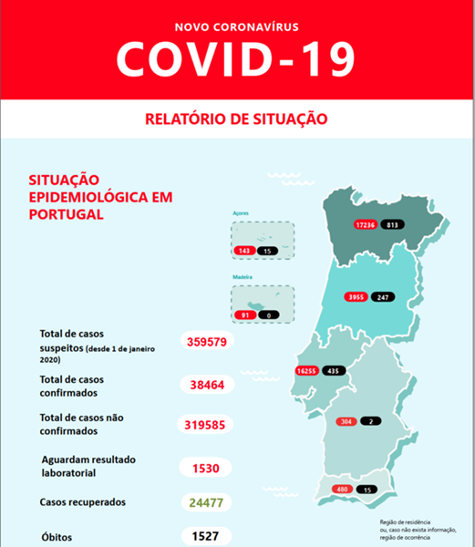
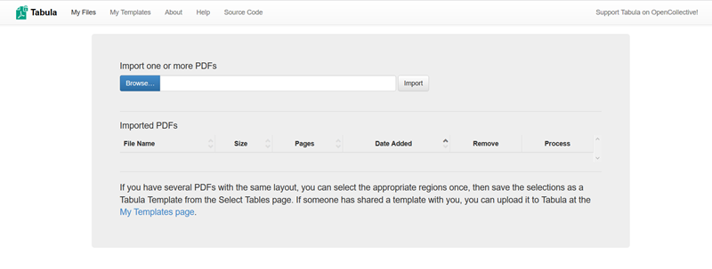
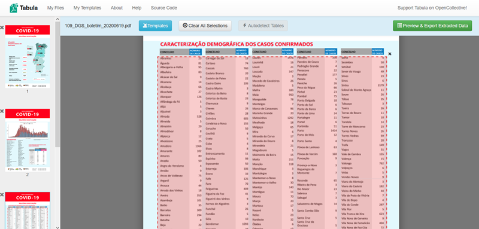
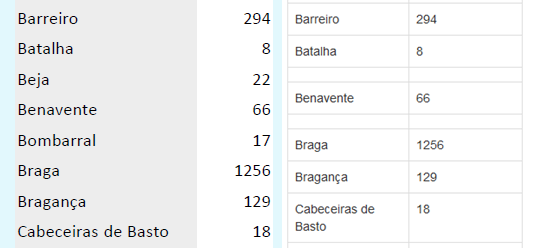
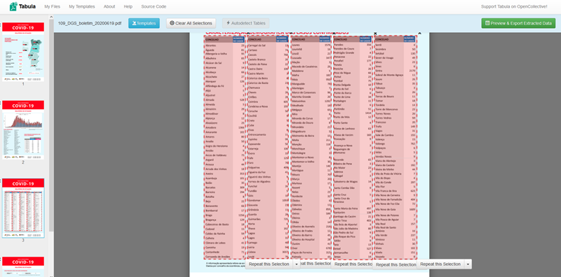
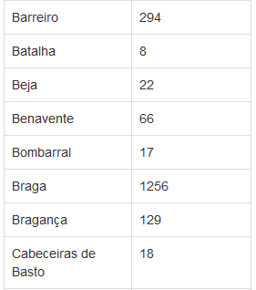
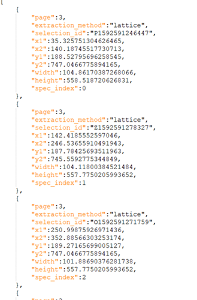
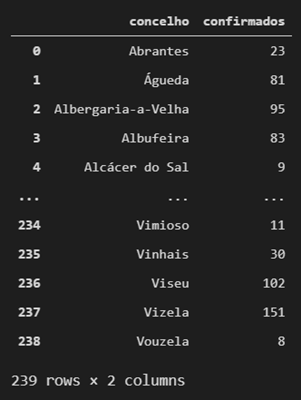

# Data scraping with Python: a COVID-19 practical example

When it comes to data science, there is a natural tendency to think of the glamorous part of it, like beautiful charts, interactive dashboards, machine learning and some advanced applications of it.

However, one of the first lessons any new data scientist should learn is that the most important ability to develop is to be able to obtain, clean and structure data - what is commonly known as data manipulation.

It is rare to have access to data already processed and available in a format that can be easily used in the construction of the desired end products. It's usually necessary to invest a lot of time and work in obtaining the data prior to be able to analyse them.

In this article I will show how to obtain data on the impact of COVID-19 in the different municipalities of Portugal, automatically, directly from the PDF reports that are released daily by the *Direcção-Geral de Saúde* (DGS) - the Portuguese health authority.
Extracting data from PDF files is perhaps one of the least trivial tasks in data scraping.

For this purpose I will use some very useful tools for data scraping:

1. [BeautifulSoup](https://www.crummy.com/software/BeautifulSoup/): Python library for pulling data out of HTML and XML;
2. [Tabula](https://tabula.technology/): tool to obtain data from tables included in PDF files, which we will use in its Python form (https://tabula-py.readthedocs.io/);
3. [Requests](https://requests.readthedocs.io): HTTP library for Python;
4. [Pandas](https://pandas.pydata.org/docs/): perhaps the most important tool for working with data structures in Python.

DGS publishes a new situation report on a daily basis on the microsite created specifically to disseminate information about the new coronavirus: https://covid19.min-saude.pt/relatorio-de-situacao.

These reports are built in a press release manner and are not designed to facilitate extraction.



To complicate things a little bit more, the PDF files can have different filenames. They tend to respect a naming format that includes the report number and the date, but there are some little variations.

To exemplify, let's look at some of the filenames:

* May 25: https://covid19.min-saude.pt/wp-content/uploads/2020/05/84_DGS_boletim_202005251.pdf
* May 27: https://covid19.min-saude.pt/wp-content/uploads/2020/05/86_DGS_boletim_20200527-1.pdf
* June 5: https://covid19.min-saude.pt/wp-content/uploads/2020/06/95_DGS_boletim_20200605V2.pdf
* June 12: https://covid19.min-saude.pt/wp-content/uploads/2020/06/102_DGS_boletim_20200612-002.pdf
* June 14: https://covid19.min-saude.pt/wp-content/uploads/2020/06/104_DGS_boletim_20200614.pdf

Although the differences in filenames are subtle, they don't allow to predict the filename of a new report simply based on the current date and the number of the previous report.
For that purpose we'll use the **BeautifulSoup** library. It allows us to access the page with links for all reports, list all links and obtain the URL of the desired report.


## Prerequisites

If you want to use a virtual environment you should create it before installing the libraries.

```
virtualenv venv
source bin/activate
```

Install **pandas**, **beatifulsoup4**, **requests** and **tabula-py** libraries.

```
pip install pandas
pip install beautifulsoup4
pip install requests
pip install tabula-py
```

The installation of **tabula** requires Java 8+ to be already installed on your OS (but most operating systems should have it by default).

We'll also use the **datetime** library, but since it is part of the [Python Standard Library] (https://docs.python.org/3/library/) there will be no need to install it (I'm using Python's 3.8.3 version).


## Obtaining today's report URL

```python
# Import required libraries
from bs4 import BeautifulSoup
import requests
from datetime import date

# Access the page that contains the list of reports
page = requests.get("https://covid19.min-saude.pt/relatorio-de-situacao")

# Get page's HTML
soup = BeautifulSoup(page.content, 'html.parser')

# Get all links on the page
links = soup.find_all('a', href=True)

# Scroll through the list of links and return the desired report URL
date_fmt = date.today().strftime("%Y%m%d") # convert today's date to the AAAAMMDD format: (e.g., 20200619)

for l in links:
    title = str(l.contents[0])

    if date_fmt in l['href']:
        url = l['href']
```

We get something like this:

```
'https://covid19.min-saude.pt/wp-content/uploads/2020/06/109_DGS_boletim_20200619.pdf'
```

Once we have the report's URL, we can download it and save it locally.
We could extract the data directly from the URL, but in this case we want to download the PDF, extract the data into a CSV file and posteriorly archive both files.

```python
LOCAL_REPORTS_PATH = "./" # Let's download the report into the current path, but you can download it into a different one changing this variable

report_filename = url.split('/')[-1].split('.')[0] # Get the filename from it's URL

report = requests.get(url) # Get the report

path = "{}/{}.{}".format( # Build a string with the desired path
    LOCAL_REPORTS_PATH,
    report_filename,
    'pdf'
)

with open(path,'wb') as f: # And save the PDF file
    f.write(report.content)
```

The file should be saved on the specified path.


## Getting the data from the report

The next step is to scrape the PDF file and extract the data we want - in this case, the one concerning municipalities.

This is the tricky part.

The table containing the data we want is on the third page of the report. We could simply try to scrape the data from the whole page, but that would mean that we would get some trash or noise that we would have to clean afterwards. So, the best option is to define the area of the page we want to read by defining its coordinates. But how to calculate them? One option would be to use a PDF editor that has the ability to do it. Another one is to use the stand-alone executable of **Tabula**, that you can download from https://tabula.technology/.

Download, unzip and run the tool. Then it should open on your browser and you should see something like this.



Select the file of the report and click on Import. The PDF will be previewed and you could go directly to the page with the desired table and select it.



Then, click on "Preview & Export Extracted Data" and you should see the results of the first attempt to scrape the data.

Tabula uses two different methods to extract the data: Stream and Lattice. While Stream method looks for whitespaces between columns of a table, Lattice approach looks for boundaries between columns.

Stream method does not work very well with these reports; so it's better to use Lattice. Apparently it works well. Tabula is even able to understand that, although the table is composed by five subtables (each containing two columns - "CONCELHO" and "NÚMERO DE CASOS"), all the data belongs to the same table and can merge it.

Unfortunately that doesn't work perfectly. Remember this was the tricky part? If you scroll down the extraction preview, you will notice that there are some municipalities missing.



So something's not working very well. And typically, if you try to preview another report (like from a few days earlier), you'll notice that the same municipalities will be missing. Therefore, there must be something in the PDF's content that is contributing to this problem; something related with the position of those municipalities in the table.

But there is an alternative approach. The tricky part of scraping PDF files is that we may need to do some adjustments. Instead of trying to scrape all the data from the table at once, we could try to scrape each of the five subtables. That way, just like magic, all the data is scraped successfully.





So what now? We want to be able to programmatically scrape data from future reports without needing to execute this manual work, right? Then, we could use the "Export" functionality, but instead of exporting the data itself, exporting a JSON file with the dimensions / coordinates, by changing the **Export Format** to *JSON (dimensions)*.

The exported file should look something like this.



We can copy the x1, x2, y1, y2 coordinates and use them to programmatically read the data from the reports. This is how we can do it in Python (notice the `lattice=True` option):

```python
# Import required libraries
import tabula
import pandas as pd

# Get the five subtables
tables = tabula.read_pdf(
    path,
    lattice=True,
    pages='3',
    area = [
        [189.27165699005127, 35.325751304626465, 750.0214776992798, 139.4437551498413],
        [189.27165699005127, 143.1622552871704, 750.0214776992798, 247.28025913238525],
        [189.27165699005127, 250.25505924224854, 750.0214776992798, 352.88566303253174],
        [189.27165699005127, 355.1167631149292, 750.0214776992798, 453.2851667404175],
        [189.27165699005127, 456.25996685028076, 750.0214776992798, 562.6090707778931]
    ]
)
```

Then, we can concatenate them into a single table containing all the data, perform some data cleaning and column renaming using **pandas** and finally we get a cleaned tidy table with all the info - concerning the municipalities - from the report.

```python
full_table = pd.concat(
    [
        tables[0],
        tables[1],
        tables[2],
        tables[3],
        tables[4]
    ]
).reset_index()

full_table = full_table.rename(
    columns={
        "CONCELHO": "concelho",
        "NÚMERO\rDE CASOS": "confirmados"
    }
)

full_table = full_table.assign(concelho = full_table.concelho.replace(r'\r',  ' ', regex=True))

full_table = full_table.filter(["concelho", "confirmados"])
```

The result should look like this:



All code used in this article is available in this repository.